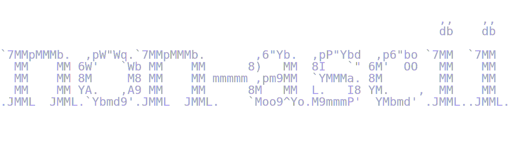

# Highlight Non-ASCII

  ![AOL](https://img.shields.io/badge/aol-3%20buddies%20online-fff?style=flat&logo=data:image/svg+xml;base64,PHN2ZyB4bWxucz0iaHR0cDovL3d3dy53My5vcmcvMjAwMC9zdmciIHdpZHRoPSIyMDAiIGhlaWdodD0iMjAwIiB2aWV3Qm94PSIwIDAgNDggNDgiIGZpbGw9IiNmZmZmZmYiPjxwYXRoIGZpbGw9Im5vbmUiIHN0cm9rZT0iI2ZmZmZmZiIgc3Ryb2tlLWxpbmVjYXA9InJvdW5kIiBzdHJva2UtbGluZWpvaW49InJvdW5kIiBkPSJNMTguMjA5IDQwLjg2TDQuNSA0MC44MzZsMTkuNTYtMzMuNzRsNS40ODMgOS41MzZtNS4wMDIgOC43TDQzLjUgNDAuOTA1aDBsLTE2LjQwMS0uMDNtNi45My0xNi40NGwuNTE2Ljg5N20tLjUxMy0uODk5Yy4wMDcgMi4wOTQtLjYwMiA0LjQxLTEuODYgNi41ODhoMGMtMS4yNDIgMi4xNTMtMi45OSAzLjkyMS00LjkzIDQuOTkyYy0yLjQxOSAxLjMzMy00LjkxOCAxLjQ2NS02LjgzMi4zNmMtMS4wNjItLjYxNC0xLjg2LTEuNTQ5LTIuMzgtMi42OTJjLTEuMjQtMi43MjQtLjkxMy02LjYyOCAxLjEzMy0xMC4xN2MuNDA3LS43MDcuODczLTEuMzc4IDEuMzg2LTEuOTk4bS02LjA2MSAxNS4xNDJjLTEuMjM1LTIuNzIzLS45MDYtNi42MjMgMS4xMzctMTAuMTYxYzEuMjQyLTIuMTUyIDIuOTg4LTMuOTIgNC45MjktNC45OWMyLjQxOC0xLjMzNSA0LjkxOC0xLjQ2NyA2LjgzNC0uMzYyYzEuMDYyLjYxNCAxLjg1OSAxLjU0OSAyLjM4IDIuNjkyYzEuMjQgMi43MjQuOTEyIDYuNjI4LTEuMTMzIDEwLjE3aDBhMTQuNTUzIDE0LjU1MyAwIDAgMS0xLjM5IDJtLTEyLjc0My42MzhjLTEuNDc2LTMuMDUtMS43NTMtNi45MDUtLjc2LTEwLjYwNmExNyAxNyAwIDAgMSAxLjg2OS00LjQwM20wIDBjLjA4NC0uMTM4LjE3LS4yNzQuMjU2LS40MW0wIDBjMi44ODEtNC40NDQgNy40My02LjYyNCAxMS41My01LjUyNWMuNzUzLjIwMiAxLjQ3NS41MSAyLjE1Mi45Mm00Ljk5NyA4LjcxM2MuMjIzIDIuMDA4LjA1NSA0LjExNC0uNDkgNi4xNDhoMGMtMS4xMTIgNC4xNTItMy42OTQgNy42NDQtNi45NTMgOS40MDltLTguODk4LS4wMTdjLTEuNTQ2LS45NDktMi44Mi0yLjQwNC0zLjcwMy00LjIzIi8+PC9zdmc+&label=AOL&labelColor=5B595C&color=78DCE8)  ![AI Free](https://img.shields.io/badge/ai-hand--crafted%20bugs-fff?style=flat&logo=data:image/svg+xml;base64,PHN2ZyB4bWxucz0iaHR0cDovL3d3dy53My5vcmcvMjAwMC9zdmciIHdpZHRoPSIyMDAiIGhlaWdodD0iMjAwIiB2aWV3Qm94PSIwIDAgMjQgMjQiIGZpbGw9IiNmZmZmZmYiPjxwYXRoIGZpbGw9IiNmZmZmZmYiIGQ9Ik0yMi4yODIgOS44MjFhNS45ODUgNS45ODUgMCAwIDAtLjUxNi00LjkxYTYuMDQ2IDYuMDQ2IDAgMCAwLTYuNTEtMi45QTYuMDY1IDYuMDY1IDAgMCAwIDQuOTgxIDQuMThhNS45ODUgNS45ODUgMCAwIDAtMy45OTggMi45YTYuMDQ2IDYuMDQ2IDAgMCAwIC43NDMgNy4wOTdhNS45OCA1Ljk4IDAgMCAwIC41MSA0LjkxMWE2LjA1MSA2LjA1MSAwIDAgMCA2LjUxNSAyLjlBNS45ODUgNS45ODUgMCAwIDAgMTMuMjYgMjRhNi4wNTYgNi4wNTYgMCAwIDAgNS43NzItNC4yMDZhNS45OSA1Ljk5IDAgMCAwIDMuOTk3LTIuOWE2LjA1NiA2LjA1NiAwIDAgMC0uNzQ3LTcuMDczek0xMy4yNiAyMi40M2E0LjQ3NiA0LjQ3NiAwIDAgMS0yLjg3Ni0xLjA0bC4xNDEtLjA4MWw0Ljc3OS0yLjc1OGEuNzk1Ljc5NSAwIDAgMCAuMzkyLS42ODF2LTYuNzM3bDIuMDIgMS4xNjhhLjA3MS4wNzEgMCAwIDEgLjAzOC4wNTJ2NS41ODNhNC41MDQgNC41MDQgMCAwIDEtNC40OTQgNC40OTR6TTMuNiAxOC4zMDRhNC40NyA0LjQ3IDAgMCAxLS41MzUtMy4wMTRsLjE0Mi4wODVsNC43ODMgMi43NTlhLjc3MS43NzEgMCAwIDAgLjc4IDBsNS44NDMtMy4zNjl2Mi4zMzJhLjA4LjA4IDAgMCAxLS4wMzMuMDYyTDkuNzQgMTkuOTVhNC41IDQuNSAwIDAgMS02LjE0LTEuNjQ2ek0yLjM0IDcuODk2YTQuNDg1IDQuNDg1IDAgMCAxIDIuMzY2LTEuOTczVjExLjZhLjc2Ni43NjYgMCAwIDAgLjM4OC42NzZsNS44MTUgMy4zNTVsLTIuMDIgMS4xNjhhLjA3Ni4wNzYgMCAwIDEtLjA3MSAwbC00LjgzLTIuNzg2QTQuNTA0IDQuNTA0IDAgMCAxIDIuMzQgNy44NzJ6bTE2LjU5NyAzLjg1NWwtNS44MzMtMy4zODdMMTUuMTE5IDcuMmEuMDc2LjA3NiAwIDAgMSAuMDcxIDBsNC44MyAyLjc5MWE0LjQ5NCA0LjQ5NCAwIDAgMS0uNjc2IDguMTA1di01LjY3OGEuNzkuNzkgMCAwIDAtLjQwNy0uNjY3em0yLjAxLTMuMDIzbC0uMTQxLS4wODVsLTQuNzc0LTIuNzgyYS43NzYuNzc2IDAgMCAwLS43ODUgMEw5LjQwOSA5LjIzVjYuODk3YS4wNjYuMDY2IDAgMCAxIC4wMjgtLjA2MWw0LjgzLTIuNzg3YTQuNSA0LjUgMCAwIDEgNi42OCA0LjY2em0tMTIuNjQgNC4xMzVsLTIuMDItMS4xNjRhLjA4LjA4IDAgMCAxLS4wMzgtLjA1N1Y2LjA3NWE0LjUgNC41IDAgMCAxIDcuMzc1LTMuNDUzbC0uMTQyLjA4TDguNzA0IDUuNDZhLjc5NS43OTUgMCAwIDAtLjM5My42ODF6bTEuMDk3LTIuMzY1bDIuNjAyLTEuNWwyLjYwNyAxLjV2Mi45OTlsLTIuNTk3IDEuNWwtMi42MDctMS41WiIvPjwvc3ZnPg==&logoColor=FFFFFF&label=AI%20Free&labelColor=5B595C&color=FC9867)    

<p align="center">
  
</p>

An Obsidian plugin that highlights any character outside the standard ASCII range (0x00-0x7F) in both Edit Mode (Live Preview) and Reading View.

Useful for catching invisible Unicode characters, accidental special characters, or non-standard punctuation in your notes.

## Features

- Highlights non-ASCII characters with a visible red background
- Works in both Edit Mode (Live Preview) and Reading View
- Configurable allowlist to exclude specific characters (accented letters, emojis, etc.)
- Per-note control via frontmatter
- Customizable highlight CSS
- Toggle on/off from settings or the command palette

## Usage

1. Install and enable the plugin.
2. Non-ASCII characters will be highlighted automatically.
3. Use **Settings > Highlight Non-ASCII** to configure:
    - **Enable highlighting** -- toggle the feature on or off
    - **Allowed characters** -- paste characters that should NOT be highlighted (e.g. accented letters, specific emojis)
    - **Custom CSS** -- edit the highlight style directly
4. Use the command palette: **Toggle non-ASCII highlighting** to quickly enable/disable.

## Disabling for specific notes

Add the following frontmatter to any note where you want to turn off highlighting:

```yaml
---
highlight-non-ascii: false
---
```

If the property is missing or set to `true`, highlighting remains active (as long as the global toggle is enabled).

## Installation

### From Obsidian Community Plugins

**Might not be approved yet**

1. Open **Settings > Community Plugins > Browse**
2. Search for "Highlight Non-ASCII"
3. Click **Install**, then **Enable**

### Manual Installation

1. Download `main.js`, `manifest.json`, and `styles.css` from the [latest release](../../releases/latest)
2. Create a folder: `<vault>/.obsidian/plugins/highlight-non-ascii/`
3. Copy the downloaded files into that folder.
4. Restart Obsidian and enable the plugin in **Settings > Community Plugins**.

## License

MIT -- see [LICENSE](LICENSE) for details.
