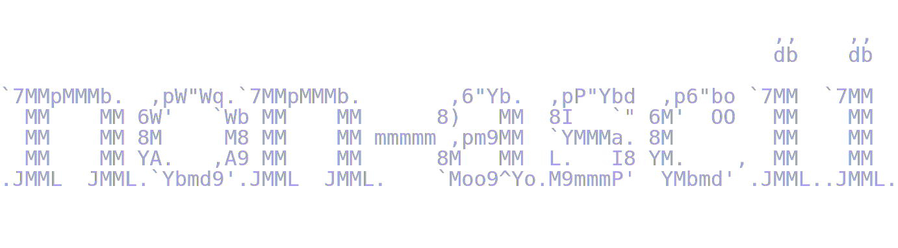
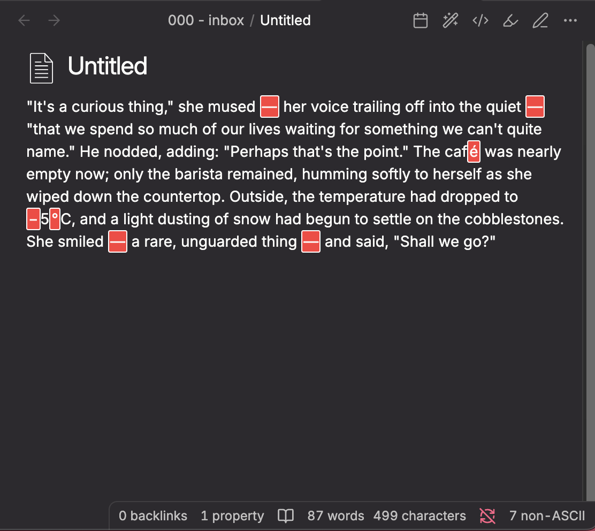
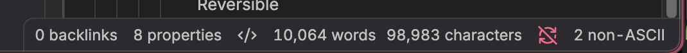
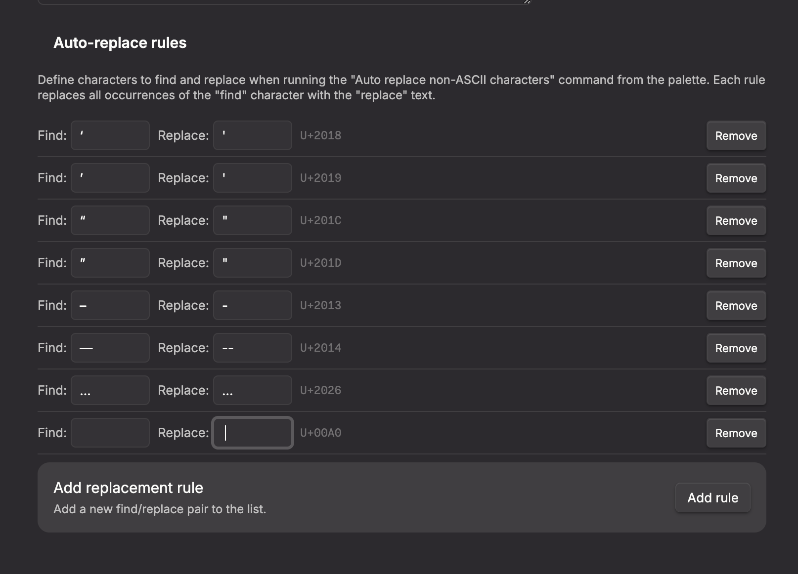

# Highlight Non-ASCII

        

<p align="center">
  
</p>

An Obsidian plugin that highlights any character outside the standard ASCII range (0x00-0x7F) in both Edit Mode (Live Preview) and Reading View.

Useful for catching invisible Unicode characters, accidental special characters, or non-standard punctuation in your notes.

## Features

- Highlights non-ASCII characters with a visible red background
- Works in Edit Mode (Live Preview) with optional Reading View support
- **Auto-replace** -- batch replace common non-ASCII characters with ASCII equivalents via the command palette
- Configurable replacement rules with a find/replace list in settings
- Configurable allowlist to exclude specific characters (accented letters, emojis, etc.)
- Per-note control via frontmatter
- **Status bar counter** -- shows the number of non-ASCII characters in the current note alongside Obsidian's word and character counts
- **Reading view toggle** -- optionally enable highlighting in preview/reading mode (off by default)
- Customizable highlight CSS
- Toggle on/off from settings or the command palette

    

## Usage

1. Install and enable the plugin.
2. Non-ASCII characters will be highlighted automatically.
3. Use **Settings > Highlight Non-ASCII** to configure:
    - **Enable highlighting** -- toggle the feature on or off
    - **Highlight in reading view** -- enable highlighting in preview/reading mode (off by default, since edit mode is usually sufficient)
    - **Allowed characters** -- paste characters that should NOT be highlighted (e.g. accented letters, specific emojis)
    - **Custom CSS** -- edit the highlight style directly
4. Use the command palette: **Toggle non-ASCII highlighting** to quickly enable/disable.

    

## Auto-replace

The plugin includes a batch replacement feature for cleaning up common non-ASCII characters like curly quotes, em dashes, and non-breaking spaces.

### How to use

1. Open a note that contains non-ASCII characters
2. Open the command palette (`Ctrl/Cmd + P`)
3. Run **Highlight Non-ASCII: Auto replace non-ASCII characters**
4. All matching characters in the note will be replaced according to your configured rules

### Default replacement rules

The plugin comes with these defaults out of the box:

| Find           | Replace | Description              |
| -------------- | ------- | ------------------------ |
| `'` (U+2018)   | `'`     | Left single curly quote  |
| `'` (U+2019)   | `'`     | Right single curly quote |
| `"` (U+201C)   | `"`     | Left double curly quote  |
| `"` (U+201D)   | `"`     | Right double curly quote |
| `--` (U+2013)  | `-`     | En dash                  |
| `---` (U+2014) | `--`    | Em dash                  |
| `...` (U+2026) | `...`   | Horizontal ellipsis      |
| ` ` (U+00A0)   | ` `     | Non-breaking space       |

### Customizing rules

You can add, edit, or remove replacement rules in **Settings > Highlight Non-ASCII** under the **Auto-replace rules** section. Each rule shows:

- **Find** -- the character to search for
- **Replace** -- the text to replace it with
- **Unicode codepoint** -- the U+ identifier for the find character
- **Remove** button to delete the rule

Click **Add rule** to create a new find/replace pair.



## Disabling for specific notes

Add the following frontmatter to any note where you want to turn off highlighting:

```yaml
---
highlight-non-ascii: false
---
```

If the property is missing or set to `true`, highlighting remains active (as long as the global toggle is enabled).

## Installation

### Obsidian Community Plugin (pending)

This plugin has been submitted for review to the Obsidian community plugin directory. Once approved, you will be able to install it directly from **Settings > Community plugins > Browse** by searching for "Highlight Non-ASCII".

### Using BRAT

You can install this plugin right now using the [BRAT](https://github.com/TfTHacker/obsidian42-brat) plugin:

1. Install BRAT from **Settings > Community plugins > Browse** (search for "BRAT" by TfTHacker)
2. Open the BRAT settings
3. Under the **Beta plugins** section, click **Add beta plugin**

    

4. In the overlay, enter this plugin's repository: `https://github.com/saltyfireball/obsidian-highlight-non-ascii` (or just `saltyfireball/obsidian-highlight-non-ascii`)

    

5. Leave the version set to latest

    

6. Click **Add plugin**

### Manual

1. Download the latest release from the [Releases](https://github.com/saltyfireball/obsidian-highlight-non-ascii/releases) page
2. Copy `main.js`, `manifest.json`, and `styles.css` into your vault's `.obsidian/plugins/highlight-non-ascii/` directory
3. Enable the plugin in **Settings > Community plugins**

## License

MIT -- see [LICENSE](LICENSE) for details.
